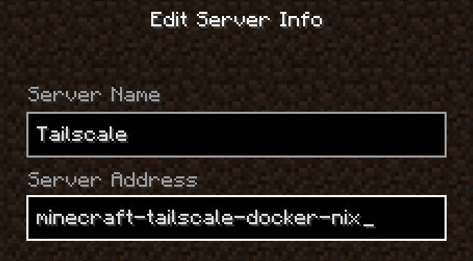

# minecraft-tailscale-docker-nix

This docker image provides a Minecraft Server with Tailscale, configured for container environment.

## :zap: Requirements

- Docker
- [Nix](https://nixos.org)
  - Flakes & Nix command need to be enabled
  - It's recommended to use [nix-installer](https://github.com/DeterminateSystems/nix-installer) instead of the official installer
- [Tailscale](https://tailscale.com)

## :rocket: Usage

1. Generate a Tailscale auth key

You can follow Step 1 of the guide on [Tailscale on Fly.io](https://tailscale.com/kb/1132/flydotio/).

2. Create a `.env` file:

```env
TAILSCALE_AUTH_KEY=<Your auth key>
TAILSCALE_HOSTNAME=minecraft-tailscale-docker-nix # Change as you like
```

3. Build and load docker image:

```bash
sh ./build.sh
```

4. Initialize the Minecraft Server (This should fail):

```bash
docker compose up
```

Then, a `server` directory will be created.

5. Edit `./server/eula.txt`:

```diff
# ...
- eula=false
+ eula=true
```

6. Launch the server:

```bash
docker compose up -d
```

And that's it! You can now start Minecraft and access the server.

If you have enabled [MagicDNS](https://tailscale.com/kb/1081/magicdns/), you can use the `TAILSCALE_HOSTNAME` instead of an IP address.



## :gear: Configuration

You can modify config files under `./server` such as `server.properties` as you like.
